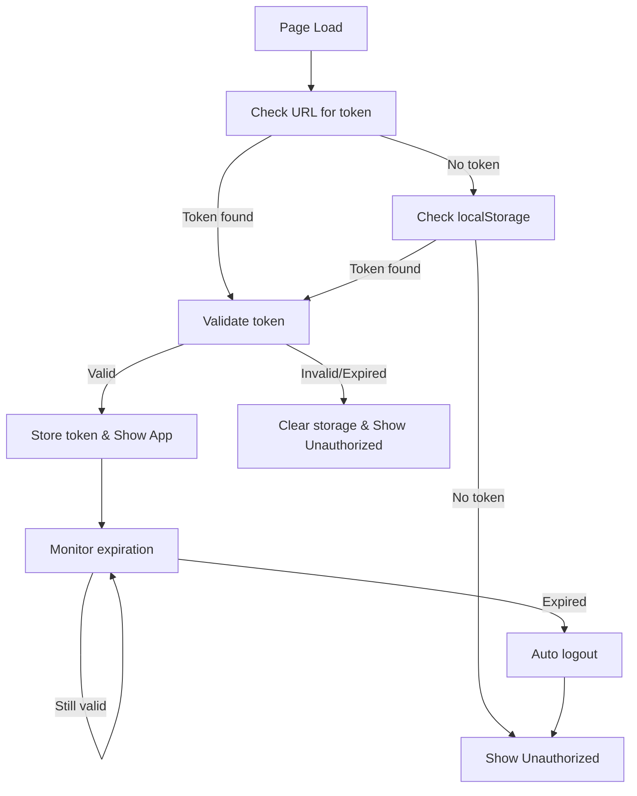

# JWT Authentication System for CeLOE Platform

Sistem autentikasi JWT yang lengkap untuk platform CeLOE dengan fitur token handling, expiration monitoring, dan unauthorized state management.

## 🚀 Fitur

- ✅ **Token Authentication**: Access platform menggunakan JWT token melalui URL parameter
- ✅ **Automatic Token Detection**: Deteksi otomatis token dari URL dan localStorage
- ✅ **Token Expiration Handling**: Monitoring dan handling token yang expired
- ✅ **Persistent Storage**: Token tersimpan di localStorage untuk session yang persistent
- ✅ **Sign Out Functionality**: Logout yang membersihkan token dan session
- ✅ **Unauthorized State View**: UI yang user-friendly untuk user tanpa token
- ✅ **Real-time Expiry Warnings**: Peringatan ketika token akan expire
- ✅ **Admin Role Support**: Support untuk role admin dengan UI yang berbeda
- ✅ **Token Generator**: Tool untuk generate test token dengan payload structure viewer

## 📁 Struktur File

```
lib/
├── auth.ts              # JWT utility functions
├── auth-context.tsx     # Auth context provider
├── jwt-generator.ts     # Token generator untuk testing
└── types.ts            # TypeScript interfaces

components/
└── auth-guard.tsx      # Auth guard component

app/
├── layout.tsx          # Root layout dengan auth provider
└── token-generator/
    └── page.tsx        # Halaman generator token
```

## 🔧 Setup

### 1. Environment Variables

Pastikan file `.env.local` berisi:

```env
SECRET_KEY=SECRET123
X_API_KEY=APIKEY123
```

### 2. Dependencies

Sistem ini menggunakan komponen UI yang sudah ada di project:
- `@/components/ui/*` (shadcn/ui components)
- `lucide-react` untuk icons
- React hooks dan context

## 📖 Cara Penggunaan

### 1. Generate Test Token

Akses halaman token generator (tidak memerlukan authentication):
```
http://localhost:3000/token-generator
```

1. Masukkan username (contoh: `admin`, `user123`, `john`)
2. Pilih durasi expiration (default: 5 menit)
3. Klik "Generate Token"
4. **Lihat "Decoded Values"** section yang otomatis terbuka
5. **Expand accordion** lainnya jika perlu detail lebih:
   - 📋 **JSON Structure & Field Descriptions** - untuk detail teknis
   - 🔗 **Base64URL Token Parts** - untuk melihat encoding
6. Copy URL atau token yang dihasilkan

**Note**: Halaman `/token-generator` dapat diakses tanpa token untuk memudahkan pembuatan token pertama kali.

### 2. Access Platform dengan Token

**Metode 1: URL Parameter**
```
http://localhost:3000/?token=eyJhbGciOiJIUzI1NiIsInR5cCI6IkpXVCJ9...
```

**Metode 2: Manual Token Storage**
Jika sudah memiliki token, simpan di localStorage:
```javascript
localStorage.setItem('auth_token', 'your-jwt-token-here');
```

### 3. Sign Out

Klik tombol logout (ikon LogOut) di pojok kanan atas untuk:
- Menghapus token dari localStorage
- Clear session state
- Redirect ke unauthorized page

## 🔐 JWT Token Format

### Header
```json
{
  "alg": "HS256",
  "typ": "JWT"
}
```

### Payload
```json
{
  "sub": "username",        // Required: username
  "name": "Display Name",   // Optional: display name
  "admin": true,           // Optional: admin flag
  "exp": 1234567890,       // Required: expiration timestamp
  "iat": 1234567890        // Optional: issued at timestamp
}
```

### Signature
Menggunakan HMAC SHA256 dengan `SECRET_KEY` dari environment.

## 📊 **Token Structure Viewer (Accordion-based)**

Token generator sekarang menyediakan visualisasi lengkap struktur JWT dalam format accordion yang dapat di-expand/collapse:

### **1. JSON Structure Display**
```json
{
  "header": {
    "alg": "HS256",
    "typ": "JWT"
  },
  "payload": {
    "sub": "username",
    "name": "Display Name", 
    "admin": true,
    "exp": 1234567890,
    "iat": 1234567890
  },
  "signature": "HMAC SHA256 (hidden for security)"
}
```

### **2. Field Descriptions**
- **Header Fields**:
  - `alg`: Algorithm yang digunakan (HS256)
  - `typ`: Tipe token (JWT)

- **Payload Fields**:
  - `sub`: Subject/username pengguna
  - `name`: Nama display pengguna
  - `admin`: Boolean untuk role admin
  - `exp`: Unix timestamp expiration
  - `iat`: Unix timestamp issued at

### **3. Decoded Values Cards**
Menampilkan nilai yang sudah di-decode dalam card terpisah:
- 🟢 **Subject**: Username yang login
- 🟣 **Display Name**: Nama yang ditampilkan
- 🟠 **Admin Role**: Yes/No admin privileges  
- 🔴 **Expires At**: Human-readable expiration time

### **4. Base64URL Token Parts**
Memecah token menjadi 3 bagian dengan color coding:
- 🔴 **Header**: Base64URL encoded header
- 🟢 **Payload**: Base64URL encoded payload
- 🔵 **Signature**: Base64URL encoded signature

Format: `header.payload.signature`

## 🎛️ **Accordion Sections**

Token structure dibagi dalam 3 accordion sections yang dapat di-expand/collapse:

### **📋 JSON Structure & Field Descriptions**
- **Left panel**: JSON structure lengkap
- **Right panel**: Penjelasan detail setiap field
- **Status**: Collapsed by default

### **🎨 Decoded Values (Quick View)**  
- Card-based display nilai yang sudah di-decode
- Color-coded untuk mudah dibaca
- **Status**: **Expanded by default** - section paling sering digunakan

### **🔗 Base64URL Token Parts**
- Breakdown token menjadi 3 bagian terpisah
- Color-coded: Header (Red), Payload (Green), Signature (Blue)
- **Status**: Collapsed by default

### **Accordion Features:**
- ✅ **Multiple expand**: Bisa buka beberapa section sekaligus
- ✅ **Default state**: "Decoded Values" terbuka secara default
- ✅ **Responsive**: Layout menyesuaikan device
- ✅ **Clean UI**: Menyembunyikan detail yang tidak diperlukan

## 🛡️ Security Features

### Token Validation
- Format validation (3 parts: header.payload.signature)
- Expiration checking
- Payload validation (required fields)

### Automatic Expiration Handling
- **One-time initialization**: Token check hanya dilakukan sekali saat akses website
- Real-time monitoring setiap 30 detik setelah authenticated
- **Auto page refresh** ketika token expired (bukan logout)
- Warning notification 60 detik sebelum expire dengan countdown timer
- Visual warning changes from orange → red when < 10 seconds left

### Secure Storage
- localStorage untuk persistence
- Cross-tab synchronization (logout di satu tab akan logout di semua tab)
- Automatic cleanup on logout

### Public Routes
Halaman yang dapat diakses tanpa authentication:
- `/token-generator` - Untuk generate test token

## 📱 UI Components

### Loading Screen
Ditampilkan saat:
- Initial authentication check
- Token verification process

### Unauthorized Screen
Ditampilkan ketika:
- Tidak ada token
- Token invalid
- Token expired

Fitur:
- Error message display
- Instructions untuk access platform
- Retry button

### User Info Card
Ditampilkan di pojok kanan atas untuk authenticated user:
- Username dan display name
- Admin badge (jika applicable)
- Logout button

### Token Expiry Warning
Alert yang muncul 60 detik sebelum token expire dengan fitur:
- **Countdown timer** real-time setiap detik
- **Color progression**: Orange (60s) → Red (10s) → Red + "Refreshing" (0s)
- **Auto refresh** halaman ketika countdown mencapai 0
- **Status messages**: "Expiring Soon" → "Expired - Refreshing..."

### Token Expiry Behavior
Ketika token expired:
1. **Warning phase** (60-11 detik): Orange alert dengan countdown
2. **Critical phase** (10-1 detik): Red alert dengan countdown
3. **Expired phase** (0 detik): Red alert "Refreshing..." + auto page reload
4. **Page refresh**: Halaman reload otomatis, restart authentication flow

## 🔄 Auth Flow



## 🧪 Testing

### Generate Test Token
1. Akses `/token-generator`
2. Generate token dengan username dan expiration yang diinginkan
3. Test dengan copy URL dan buka di tab baru

### Test Scenarios
1. **Valid Token**: Normal access ke platform
2. **Expired Token**: Automatic logout dan redirect ke unauthorized
3. **Invalid Token**: Error handling dan unauthorized view
4. **No Token**: Unauthorized view dengan instructions
5. **Admin Token**: Username dengan "admin" akan mendapat admin role

## 🚨 Production Considerations

⚠️ **PENTING**: Generator token saat ini hanya untuk testing!

Untuk production:
1. **Server-side Token Generation**: Generate token di backend dengan proper cryptographic signing
2. **Secure Secret Management**: Gunakan environment variables yang aman
3. **HTTPS Only**: Pastikan semua komunikasi menggunakan HTTPS
4. **Token Refresh**: Implementasi refresh token mechanism
5. **Rate Limiting**: Implementasi rate limiting untuk auth endpoints
6. **Audit Logging**: Log semua authentication activities

## 🛠️ Customization

### Mengubah Token Expiration Default
Edit di `lib/jwt-generator.ts`:
```typescript
static createPayload(username: string, expirationMinutes: number = 5)
```

### Mengubah Warning Time
Edit di `components/auth-guard.tsx`:
```typescript
setShowWarning(remaining > 0 && remaining <= 60); // 60 seconds warning
```

### Custom User Roles
Edit payload generation di `lib/jwt-generator.ts`:
```typescript
admin: username.includes('admin') || username.includes('superuser')
```

## 📝 API Integration

Untuk integrasi dengan backend API, tambahkan token ke request headers:

```typescript
const token = JWTAuth.getStoredToken();
if (token) {
  headers['Authorization'] = `Bearer ${token}`;
}
```

## 🐛 Troubleshooting

### Tidak bisa akses platform sama sekali
1. **Akses token generator**: Buka `http://localhost:3000/token-generator` (tidak perlu token)
2. **Generate token baru** dengan username dan expiration yang diinginkan
3. **Copy URL** dan buka di tab baru

### Token tidak terdeteksi
1. Periksa URL parameter format
2. Periksa localStorage di browser DevTools
3. Periksa console untuk error messages
4. Coba akses token generator untuk membuat token baru

### Token check terus menerus (infinite loop)
**✅ FIXED**: Masalah ini sudah diperbaiki dengan:
- One-time initialization saat akses website
- Menghilangkan circular dependencies di auth context
- Menggunakan useRef untuk interval management

### Halaman terus refresh ketika login
1. **Check token expiry**: Generate token baru dengan expiration yang lebih lama
2. **Periksa system time**: Pastikan waktu komputer akurat (sync dengan NTP)
3. **Console logs**: Periksa console untuk "Token expired" messages
4. **Network issues**: Pastikan tidak ada masalah konektivitas yang delay token refresh

### Auto refresh behavior
**Normal behavior**: 
- Halaman akan auto refresh ketika token expired
- Setelah refresh, user akan ke unauthorized page jika tidak ada token valid
- Generate token baru untuk login kembali

### UI tidak update setelah login
1. Refresh halaman
2. Clear localStorage dan login ulang  
3. Periksa console untuk React errors
4. Pastikan tidak ada JavaScript errors yang menghalangi rendering

## 🤝 Contributing

Untuk menambah fitur atau fix bugs:
1. Edit file yang sesuai di `lib/` atau `components/`
2. Test dengan token generator
3. Update dokumentasi jika diperlukan

---

*Dibuat untuk CeLOE Platform - Telkom Admin Dashboard* 